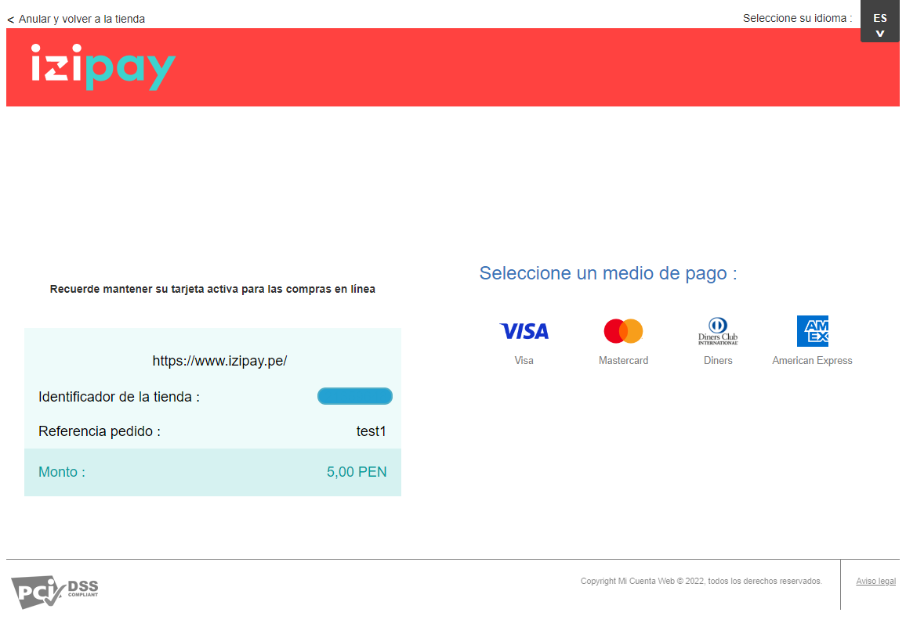

# Redirect-Form-Izipay-PHP

<p align="justify">Ejemplo de un formulario en redirección con PHP, este ejemplo te servira como guia para poder ejecutar el formulario de pago de Izipay en cualquier proyecto que utilice el lenguaje de programacion php.PHP es un lenguaje de programación destinado a desarrollar aplicaciones para la web y crear páginas web, favoreciendo la conexión entre los servidores y la interfaz de usuario.</p>



## Este ejemplo es solo una guía para poder realizar la integración de la pasarela de pagos, puede realizar las modificaciones necesarias para su proyecto.

<a name="Requisitos_Previos"></a>

## Requisitos Previos.

* Acceso al Back Office Vendedor (BOV) y Claves de autenticación. [Guía Aquí](https://github.com/izipay-pe/obtener-credenciales-de-conexion)
* Descargar el manual desde [Manual Izipay - implementación en REDIRECCIÓN](https://secure.micuentaweb.pe/doc/es-PE/form-payment/quick-start-guide/sitemap.html)
* Instalar XAMPP [Aquí](https://www.apachefriends.org/es/index.html)
* PHP 7.0 o supior
* Servidor Web

## 1.- Crear el proyecto 
Descargar el proyecto .zip ingresado [aquí](https://github.com/izipay-pe/Redirect-PaymentForm-PHP/archive/refs/heads/main.zip) ó clonarlo con git

```sh
git clone https://github.com/izipay-pe/Redirect-PaymentForm-PHP.git
``` 

* Paso 1.- Mover el proyecto y descomprimirlo en la carpeta htdocs en la ruta de instalación de Xampp: `C:\xampp\htdocs`

  

* Paso 2.- Abrir la aplicación XAMPP Control Panel y ejecutar el botón **Start** del modulo de **Apache**, quedando de la siguiente manera:

  

* Paso 3.- Abrir el navegador web (Chrome, Mozilla, Safari, etc): **http://localhost:80/Redirect-PaymentForm-PHP/** y realizar una compra de prueba.

  

* **Error: PaymentFormError = 02 vads_side_id**, este error saldrá porque no se tiene configurado las credenciales de integración en el archivo **./example.configKey.php** .  
 Estas mismas credenciales se encuentran en su [Back Office Vendedor de Izipay](https://secure.micuentaweb.pe/vads-merchant/) en la siguiente ruta: **Configuracion - Tienda - Claves**  
 Más información [Ver requisitos previos](#Requisitos_Previos).
 
  

## 2.- Subirlo al servidor web
Para este ejemplo se utilizó el servidor gratuito de [000webhost](https://www.000webhost.com/), ingrese a su cuenta de [000webhost](https://www.000webhost.com/) y siga los siguientes pasos.

* **Paso 1:** Crearse un nuevo sitio.

  

* **Paso 2:** Crear una URL pública y generar una contraseña de acceso a su sitio.

    

* **Paso 3:** Seleccionar File Manager para subir el proyecto.  

    

* **Paso 4:** Seleccionar la carpeta `public_html` y subir los archivos del proyecto .zip   

  ```sh
  index.php
  infoPayment.php
  pagoFinalizado.php
  example.configKey.php
  css/style.css
  ```
  


  Ver el resultado en: https://tusitio.000webhostapp.com   

* **Paso 5: Configurar datos de conexión**
  Obtener las credenciales de su Back Office Vendedor, [ver requisitos previos](#requisitos-previos), y copiarlas en las variales correspondientes en el archivo: `example.configKey.php ` 

  ```sh
  //Identificador de su tienda
  $_SHOP_ID = "XXXXXXXXXXXX"; 

  //Clave de TEST O PRODUCCIÖN de su tienda.
  $_KEY = "XXXXXXXXXXXXXXXXXXXXXXX";

  //URL del servidor de Izipay
  $_URL_IZIPAY = "https://secure.micuentaweb.pe/vads-payment/";
  ``` 

## 3.- Transacción de prueba
El formulario de pago está listo, puede intentar realizar una transacción utilizando una tarjeta de prueba. Consulte tarjetas de prueba [Aquí](https://secure.micuentaweb.pe/doc/es-PE/rest/V4.0/api/kb/test_cards.html).   
* **Tarjeta de prueba VISA:**  
  * Número de tarjeta: 4970100000000055   
  * Fecha de vencimiento: 12/30   
  * Código de seguridad: 123

NOTA:

**1.-** Paso de la tienda al modo producción
```diff
 Modifique su implementación para utilizar redireccion:
 * Complete el campo vads_ctx_mode a PRODUCTION .
 * Cambie el valor de la clave de prueba con el valor de su clave de producción para calcular la firma.
 * Encontrará este valor en el menú Configuración > Tienda > pestaña Claves .
 * Complete la URL de notificación correctamente al final del pago en el modo PRODUCCIÓN en el menú Configuración > Reglas de notificaciones .
```

## 4.- Gestionar la notificacion de fin de pago (IPN)
<p align="justify">
IPN son las siglas de Instant Payment Notification (URL de notificación instantánea, en inglés). Al crear una transacción o cambiar su estado, nuestros servidores emitirán una IPN que llamará a una URL de notificación en sus servidores. Esto le permitirá estar informado en tiempo real de los cambios realizados en una transacción.
</p>

Las IPN son la única manera de recibir notificaciones en los casos siguientes:

* La conexión a Internet del comprador se ha cortado.
* El comprador cierra su navegador durante el pago.
* Se ha rechazado una transacción.
* El comprador no ha terminado su pago antes de la expiración de su sesión de pago.

Por lo tanto, es obligatorio integrar las IPN.

<p align="center">
  
</p>  

* Ver manual de implementacion de la IPN [Aquí](https://secure.micuentaweb.pe/doc/es-PE/rest/V4.0/kb/payment_done.html)

* Ver el ejemplo de la respuesta IPN con PHP [Aquí](https://github.com/izipay-pe/Redirect-PaymentForm-IpnT1-PHP)

* Ver el ejemplo de la respuesta IPN con NODE.JS [Aquí](https://github.com/izipay-pe/Response-PaymentFormT1-Ipn)